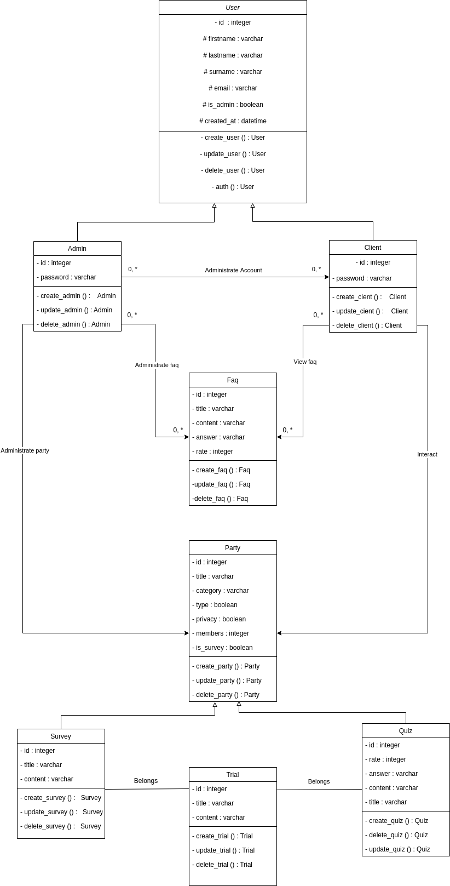

# Quizreo
A web application: simple and minimalistic for people who like quiz games and surveys

## Description

Quizreo is aiming to help people to create survey form and quiz games that they are willing to share with anyone.

## Diagrams

### Use case diagram

Presenting the main use cases of the application : 

### Class diagram

Presenting the classes used to manage the datas of the application:

## Technologies

### Quizreo_frontend: 

* [reactjs](https://reactjs.org/t)
* [react-socks](https://www.npmjs.com/package/react-socks)
* [react-router-dom](https://v5.reactrouter.com/)
* [firebase](https://firebase.google.com/)

## Features

Main features are listed below: 

### User
* Manage account
* Manage profile
* Delete account

### Surveys & quizzes
* Create new resource
* Update resource
* Delete resource
* Share resource
* Take test 

## Demo

__Coming soon__

## Usage

You can view demo on the host address: __coming soon__

You can view a part of the projectv by cloning the submodules

## Contributing

* You can contribute in various ways: 
* Declare bugs or suggest updates via issues
* Improve codebase 

## Authors

[Pericles001](https://github.com/Pericles001)

